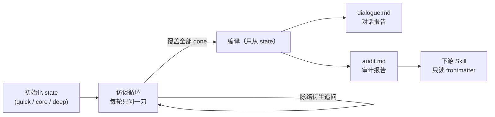

# 自我表达审计 · self-expression-audit


用**访谈**挖清一个人的表达结构：提纲必覆盖，脉络可衍生。  
产出可拆分导出、可持久化、可被下游 AI Skill 直接消费的**对话报告**与**审计报告**。

> **你即你的表达。** 这是一个自我发现工具——不是品牌包装器，也不做人格测评。

---

## 为什么是「审计」

大多数人描述自己的表达时，只能给出标签（"我做知识分享"）或引用别人的话。这个 Skill 用一次结构化访谈把底层结构挖出来：

- **访谈，不是问卷** —— 题号只是覆盖索引，Agent 沿你回答的脉络衍生追问；一次只问一刀，不打断正在展开的故事。
- **证据链，不是标签** —— 每条结论都要能指回你的原话；回答之间的矛盾被保留为「张力」，优先于整洁的结论。
- **可消费的报告** —— 审计报告带机器可读的 YAML frontmatter 契约，改稿、选题、发布前检查等下游 Skill 可直接读取。

## 工作原理



- Agent 每轮从 [references/interview-engine.md](references/interview-engine.md) 的决策树选「此刻最该问的那一刀」，并立即写回 state。
- **state 是唯一真源**：报告只从 state 编译，永不凭空生成。
- 覆盖全部完成后收敛为「四句话」（我相信 / 所以我希望 / 我绝不希望 / 因此我选择），编译双报告落盘。

## 快速开始

### 1. 安装

前置要求：支持读取 `SKILL.md` 的 Agent（如 Claude Code）；Python 3 与 git 仅脚本和自更新需要。

把仓库克隆到 Agent 的 Skill 目录，例如：

```bash
# Claude Code 用户级
git clone https://github.com/RevaHuai/self-expression-audit.git ~/.claude/skills/self-expression-audit

# 或项目级
git clone https://github.com/RevaHuai/self-expression-audit.git .claude/skills/self-expression-audit
```

其他 Agent 放到对应的 skill 目录即可。访谈数据写在**工作区** `{workspace}/expression-audit/`，不进本仓库。

### 2. 对 Agent 说

```text
使用自我表达审计，quick 模式，subject 叫 Alice
```

然后正常回答问题。常用指令：

| 你说 | Agent 做 |
|------|----------|
| `使用自我表达审计，核心模式，subject 叫 Alice` | 新开 core 审计 |
| `继续我的自我表达审计` | 载入未完成 state，跨会话续作 |
| `先出报告` / `只要对话报告` / `只要审计报告` | 立即编译并落盘 |
| `升级到深度模式` | 升级模式，已答内容全部保留 |
| `导出到 exports` | 生成时间戳副本，不覆盖主文件 |
| `深度探索北极星` | D0 完成后的可选分析引擎（不问新题） |

### 3. 得到什么

```text
{workspace}/expression-audit/
├── {subject}.state.json     # 唯一真源：rawData、coverage、thread、tensionLog
├── {subject}.dialogue.md    # 对话报告（给被访谈者回顾）
├── {subject}.audit.md       # 审计报告（给人 + 下游 Skill）
└── exports/                 # 可选时间戳副本
```

| | 对话报告 | 审计报告 |
|--|----------|----------|
| 原文问答 | 主文（按话轮时间线） | 仅证据索引 |
| 结构结论 | 少 | 主文（身份、四句话、Quick Reference、禁区、张力） |
| frontmatter 契约 | 无 | **必须**（`schema: expression-audit-report`） |
| 下游 Skill | 一般不读 | **主输入** |

## 运行模式

| 模式 | 必覆盖 | 覆盖范围 | 适合 |
|------|--------|----------|------|
| `quick` | **10** | 高密度精选（含 Q96 一刀辨别力），约 25 分钟 | 第一次接触、快速体检 |
| `core` | **70** | D0+D1+D2+D5+D6（不含 D3/D7） | 完整坐标系与愿景/机制/禁区 |
| `deep` | **95** | core + D3 + D7 | 审美与辨别力可复核 |

模式可中途升级（quick→core→deep），rawData 与对话全程保留，审计报告按新模式重编译。

## 题号口径（必读）

**有效提纲 95 题**；编号保留 Q1–Q108；**Q61–Q73 为空号**（原 D4 已删，禁止补造）。  
提纲是覆盖清单，不是播放列表。真源：[references/numbering.md](references/numbering.md)。

| 模块 | 题号 | 题量 | 挖什么 |
|------|------|------|--------|
| D0 | Q1–Q18 | 18 | 北极星、领域、身份 |
| D1 | Q19–Q33 | 15 | 信念、反共识、愿景 |
| D2 | Q34–Q48 | 15 | 表达机制与声音 |
| D3 | Q49–Q60 | 12 | 审美禁区（仅 deep） |
| — | Q61–Q73 | **0** | **空号，禁止补造** |
| D5 | Q74–Q85 | 12 | 内容架构与节律 |
| D6 | Q86–Q95 | 10 | 绝对禁区、反愿景 |
| D7 | Q96–Q108 | 13 | 危险信号（deep；quick 仅 Q96） |

## 脚本工具（可选）

访谈由 Agent 驱动，脚本只做初始化、校验与导出：

| 脚本 | 作用 |
|------|------|
| `scripts/init_state.py` | 初始化 state：`--workspace` / `--subject` / `--mode quick\|core\|deep` |
| `scripts/validate_coverage.py` | 覆盖率检查；`--strict-raw` 额外要求每题有 rawData 原文 |
| `scripts/export_reports.py` | 导出报告：`--only dialogue\|audit\|both`，`--to main\|exports\|both` |
| `scripts/upgrade_mode.py` | 模式升级：`--to quick\|core\|deep`，`--allow-downgrade` 需显式传入 |
| `scripts/update.sh` | Skill 自更新：`bash scripts/update.sh [--yes]` |

```bash
python3 scripts/init_state.py --workspace "$PWD" --subject Alice --mode core
python3 scripts/validate_coverage.py --workspace "$PWD" --subject Alice
python3 scripts/export_reports.py --workspace "$PWD" --subject Alice --only both
python3 scripts/upgrade_mode.py --workspace "$PWD" --subject Alice --to deep
```

`update.sh` 不改写 `git remote origin`，工作区有未提交改动会拒绝，也不会清理 `expression-audit/` 里的访谈数据。

## 下游消费契约

其他 Skill **只读审计报告**即可工作，不要解析访谈过程或改写 state。  
核心 frontmatter 字段：

```yaml
schema: expression-audit-report
schema_version: "2"
subject: Alice
mode: core
confidence: moderate        # preliminary 时下游应降低断言强度
north_star: "..."
identity: "..."
belief: "..."               # 四句话操作系统
vision: "..."
anti_vision: "..."
practice: "..."
always: []                  # 必须保留的表达行为
never: []                   # 硬禁止
signature_moves: []         # 可强化的手法
voice: []
taboos: []
tensions: []                # 生成时保留，勿强行统一
insufficient: []            # 这些字段不可当事实用
```

合规用法（把 `never` + `taboos` 当硬过滤、需要立场时用四句话）与完整字段语义见 [references/consumer-contract.md](references/consumer-contract.md)。

## 仓库结构

```text
.
├── SKILL.md                 # Agent 入口：循环、硬规则、停止条件
├── README.md
├── references/              # 口径、调度、编译、下游契约、思想来源
├── modules/                 # 题面（D0–D3, D5–D7）
├── quick-mode/              # quick 十题精选
├── proto-system/            # 原型锚点流程（无十二型词典）
├── schemas/state.schema.json
├── state-schema.json        # 根目录兼容副本（以 schemas 为准）
├── scripts/                 # init / validate / export / upgrade / update
├── evals/                   # 行为契约样本（不是通过性证明）
└── compiler/compile.md      # 兼容入口 → references/compile.md
```

## 边界

- 不代写内容、不做人设包装、不做娱乐化人格测评
- 不替你下道德判断或「正确人生」裁决
- 不是 Big Five / MBTI 等常模量表，不是临床或心理诊断
- `proto-system/` 只有假设→验证**流程**，无十二型词典；锚点输出必须标 `hypothesis_only`
- 信息不足的字段标 `insufficient_data`，不编造

## FAQ

**访谈数据存在哪？** 在你的工作区 `{workspace}/expression-audit/`，与本 Skill 仓库分离；自更新不会碰它。

**中途能停吗？** 每个话轮结束都会写回 state，随时可停、跨会话续作。

**quick 之后升 core，之前白答了吗？** 没有。rawData 与对话全部保留；quick 的 Q96 留在 rawData 但不进 core coverage（core 不含 D7），升 deep 时自动恢复为已答。

## 思想来源

### 直接来源

本 Skill 改编自 **AL3（Alan Yin）/ EDUPUNK** 在《[品牌审计框架使用指南](https://mp.weixin.qq.com/s/8aEkNved6MdqYOPoTzWqMw)》中公开的 **Brand Self-Audit Framework v3**（108 题品牌自我审计访谈框架，[CC BY-SA 4.0](https://creativecommons.org/licenses/by-sa/4.0/)）；该框架又受 [Ruben 的写作风格采写](https://ruben.substack.com/p/i-am-just-a-text-file)启发。

由此继承的骨架：

- **七模块提纲** —— 北极星 / 信念 / 表达机制 / 审美 / 内容架构 / 硬禁区 / 危险信号，现存模块题量一一对应（18/15/15/12/12/10/13）
- **访谈规则** —— 一次一问、对模糊回答追问、要具体例子、矛盾即张力（tension 优先于整洁）
- **双文档输出** —— 逐字原始数据 + 供模型消费的结构化文档

相对原框架的主要演化：

- 视角从「品牌」转向「自我表达」——不是品牌包装器，不做人设
- 删除原 D4（Voice & Personality，13 题），形成 **95 题口径与 Q61–Q73 空号**
- 品牌十二人格原型改为假设→验证的原型锚点流程（无词典，一律 `hypothesis_only`）
- 新增工程层：state 唯一真源、调度引擎、双报告编译、下游消费契约与 quick/core/deep 三模式

原框架要求改编时注明出处——"Good frameworks, like good brands, deserve their lineage traced." 谨此致谢。

### 理论锚点

题库显式锚定了 Fred Polak《The Image of the Future》、Peter Senge 正/负愿景、趋近/逃避动机、Ikigai、70/20/10 等，并明确「不是什么」：见 [references/intellectual-sources.md](references/intellectual-sources.md)。

## 版本

- **v2.1**：95 题口径 / 空号 Q61–Q73；schema 2.1；双报告与安全更新脚本
- **v2**：访谈引擎 + workspace 落盘 + 下游契约
- **v1**：题库文案（沿用至今，改变的是调度语义）
